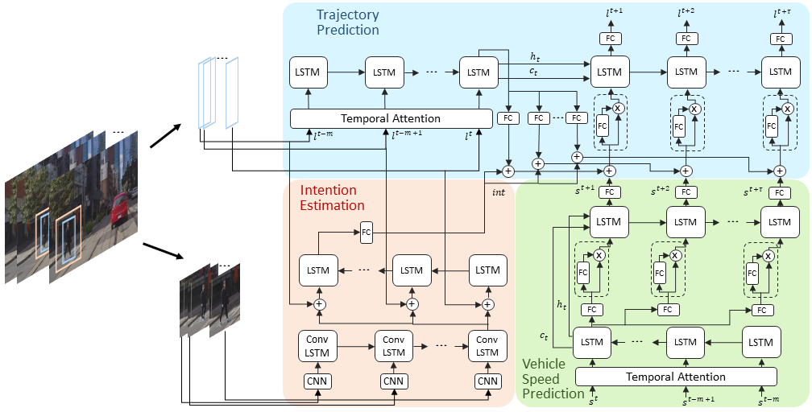

# PIE Predict

<p align="center">

</p>

This is the python implementation for paper **A. Rasouli, I. Kotseruba, T. Kunic, and J. Tsotsos, "PIE: A Large-Scale Dataset and Models for Pedestrian Intention Estimation and Trajectory Prediction", ICCV 2019.**


### Table of contents
* [Dependencies](#dependencies)
* [Datasets](#datasets)
* [Train](#train)
* [Test](#test)
* [Citation](#citation)
* [Corresponding authors](#authors)
* [License](#license)


<a name="dependencies"></a>
## Dependencies
The interface is written and tested using python 3.5. The interface also requires
the following external libraries:<br/>
* tensorflow (tested with 1.9 and 1.14)
* keras (tested with 2.1 and 2.2)
* scikit-learn
* numpy
* pillow

<a name="datasets"></a>
## Datasets
The code is trained and tested with [PIE](http://data.nvision2.eecs.yorku.ca/PIE_dataset/) and [JAAD](http://data.nvision2.eecs.yorku.ca/JAAD_dataset/) datasets.


<a name="train"></a>
## Train

<a name="test"></a>
## Test


<a name="citation"></a>
## Citation
If you use our dataset, please cite:
```
@inproceedings{rasouli2017they,
  title={PIE: A Large-Scale Dataset and Models for Pedestrian Intention Estimation and Trajectory Prediction},
  author={Rasouli, Amir and Kotseruba, Iuliia and Kunic, Toni and Tsotsos, John K},
  booktitle={ICCV},
  year={2019}
}

```
<a name="authors"></a>
## Corresponding authors

* **[Amir Rasouli](http://www.cse.yorku.ca/~aras/index.html)**
* **[Iuliia Kotseruba](http://www.cse.yorku.ca/~yulia_k/)**

Please send email to yulia_k@eecs.yorku.ca or aras@eecs.yorku.ca if there are any problems with downloading or using the data.

<a name="license"></a>
## License
This project is licensed under the MIT License - see the [LICENSE](LICENSE) file for details
